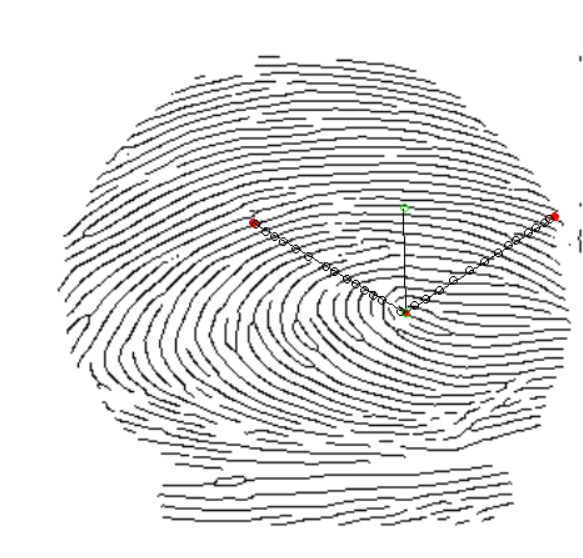

# Ridge counting code for fingerprint images
This function package is designed to count ridge lines intersection between two GUI chosen points and ridge line intersection to two lines with 90 degree angle to each other. The package was designed for images that have been binarized and thereafter skeletonized. The locations of the intersections are counted and shown on a plotted image in R for verification. Output value is the amount of intersected points. 

The function horizontal_ridge_count is for ridge counting of a horizontal line and the function ridge_count is for counting intersected points on a sloped line. 

The function density is for the ridge count of the two lines that have 90 degrees angle to each other. Directional vector chooses the middle of the two lines. GUI choosen points determine the directinal vector. 

The file ridge_count.R contains the three functions and is created for R.

## Prior fingerprint requirement
Before ridge counting is performed prior image alteration is needed to convert the images to a black and white binary mode where 0 is chosen as a value for black pixels. It is preferable to thinn the ridge lines to a width of 1 pixel as the code has not been tested for un-skeletonized images. 

In the development of the code .png images where used and altered by the use of [Utkarsh-Deshmukh/Fingerprint-Enhancement-Python](https://github.com/Utkarsh-Deshmukh/Fingerprint-Enhancement-Python) for binarization and ridge enhancement. Code from [linbojin/Skeletonization-by-Zhang-Suen-Thinning-Algorithm](https://github.com/linbojin/Skeletonization-by-Zhang-Suen-Thinning-Algorithm) was used for skeletonization.  

## Input and output
Input for both functions is the location and the name for a png. image, e.g.
```
horizontal_ridge_count("c:/Folder/Pictures/fingerprint_image.png")
```
or

```
ridge_count("c:/Folder/Pictures/fingerprint_image.png")
```

or

```
density("c:/Folder/Pictures/fingerprint_image.png")
```

The output is the count of ridge count and a plotted image with intersected points as can be seen below for horizontal_ridge_count():


For density():



The functions horizontal_ridge_count() and ridge_count() require input where two points that are chosen on a plotted image which corresponds to the limits of the line which ridge intersection will be counted.


The horizontal_ridge_count requires the first point to be higher than the second chosen plot on the image. The first chosen point determines the x-axis location of the line. 
The density function requires the first point to be the location where the two lines intersect and the secon point will be the direction of a line that goes through is in the middle of the two lines. 

### Notes to consider

The ridge_count value can be biased when the line is nearly horizontal or vertical so visual confirmation is needed for accurate assessment.
