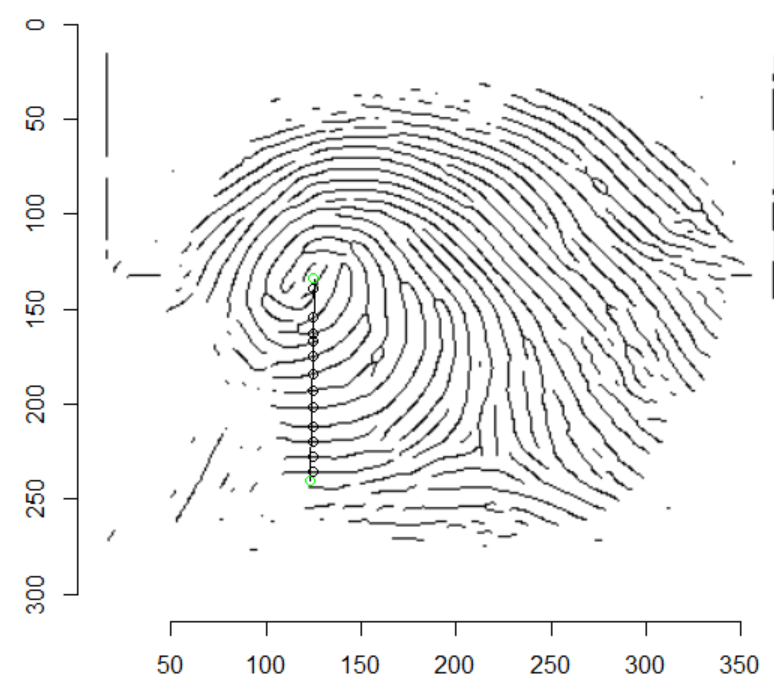

# Ridge counting code for fingerprint images
This function package is designed to count ridge lines of binary skeletonized fingerprint images by either a horizontal line, the funcion horizontal_ridge_count, or a sloped line, the function ridge_count.

The file ridge_count.R contains both functions and is created to for R. 

## Prior fingerprint requiremnt
Before ridge counting is performed there is a requirement for alter fingerprint images to a black and white binary mode where 0 is chosen as a value for a black pixel.
In the development of the code .png images where used and altared by the use of [Utkarsh-Deshmukh/Fingerprint-Enhancement-Python](https://github.com/Utkarsh-Deshmukh/Fingerprint-Enhancement-Python) for binarizaiton and ridge enhancement along with code from [linbojin/Skeletonization-by-Zhang-Suen-Thinning-Algorithm](https://github.com/linbojin/Skeletonization-by-Zhang-Suen-Thinning-Algorithm) for skeletonization. New images where created for to be used for the code. 

## Input and output
Input for both functions is the location and the name for an image, f.e.
```
horizontal_ridge_count("c:/Folder/Pictures/fingerprint_image.png")
```
or

```
ridge_count("c:/Folder/Pictures/fingerprint_image.png")
```
The ouput is the count of ridge count and a plotted image with intersected points as can be seen below:

